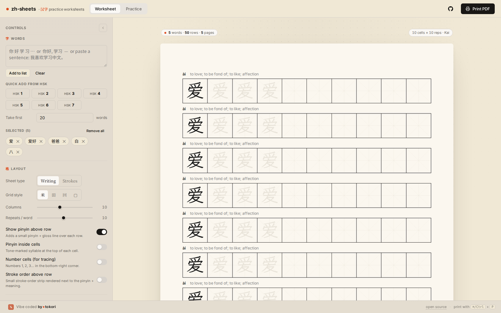
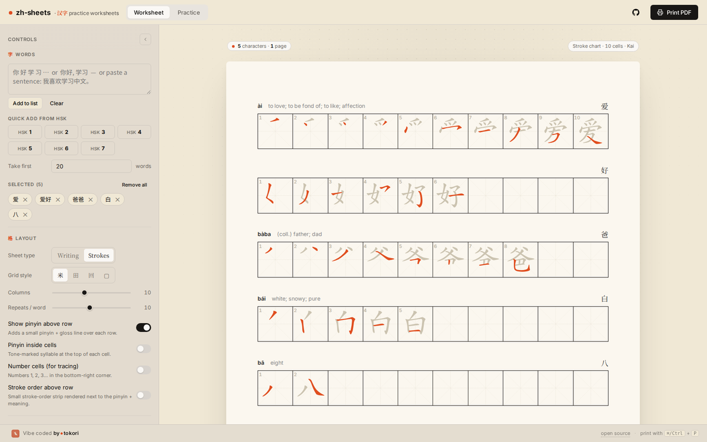
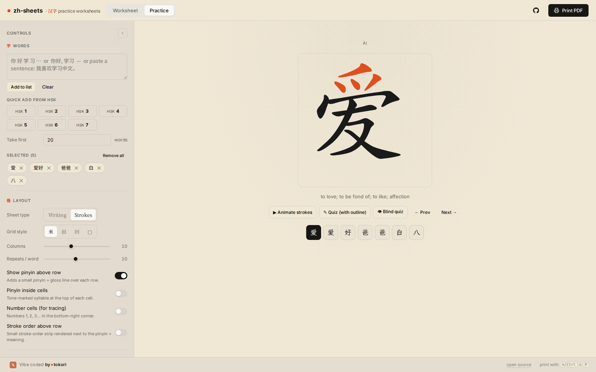

<p align="center">
  
</p>

<h1 align="center">zh-sheets</h1>

<p align="center">
  Printable <strong>汉字 practice worksheets</strong> and in-browser stroke practice — free, offline-friendly, no accounts.
  <br />
  <a href="https://tokoriai.github.io/zh-sheets/"><strong>Use it in your browser →</strong></a>
</p>

<p align="center">
  <a href="LICENSE"></a>
  
  <a href="https://tokori.ai"></a>
</p>



## What it does

**zh-sheets** generates the classic Chinese-school writing sheet: rows of 米字格 / 田字格 cells where each word starts solid, fades into ghost copies to trace, and ends in blank cells to write freehand. Pick words, tune the layout live in an exact A4 preview, hit print.

- **Writing sheets** — 米 / 田 / 回 / blank grids, solid → trace → freehand progression, pinyin + meaning above each row, optional pinyin inside cells, cell numbering, and tiny stroke-order strips.
- **Stroke-order charts** — one cell per stroke with the current stroke highlighted, laid out in the same grid cells students write in.
- **Practice mode** — animated stroke order, guided quiz, and blind quiz right in the browser (powered by [Hanzi Writer](https://hanziwriter.org)).
- **HSK 1–7/9 vocabulary built in** — 10,600+ words with tone-marked pinyin and CC-CEDICT glosses. Or paste any text: sentences are segmented into words automatically (我喜欢学习中文 → 我 · 喜欢 · 学习 · 中文).
- **Seven fonts** — from textbook 楷体 (bundled [LXGW WenKai](https://github.com/lxgw/LxgwWenKai) when your system has no Kai font) to brush and cursive styles.
- **True-size printing** — the preview is authored in real millimetres; `Ctrl/⌘ P` → *Save as PDF* gives you a pixel-exact A4 sheet, including a clickable footer link.
- **Your sheet survives a refresh** — words and every layout choice are saved to `localStorage`. No server, no tracking, no account.

| Stroke-order chart | Practice mode |
| --- | --- |
|  |  |

## Run it

It's a static page — there is nothing to install or build.

```bash
git clone https://github.com/tokoriai/zh-sheets.git
cd zh-sheets
python3 -m http.server 8000   # or: npx serve
# open http://localhost:8000
```

Opening `index.html` straight from disk works too. The only network dependencies are webfonts and stroke-order data, both loaded from CDNs on demand — worksheets themselves render fine without them.

## Printing tips

In the browser print dialog choose **Save as PDF**, set margins to **None**, and untick *Headers and footers*. Paper backgrounds and grid guides are forced on via `print-color-adjust`, so the sheet prints exactly like the preview.

## Project layout

```
index.html        markup + controls
styles.css        Tokori-flavored design system, screen + print styles
app.js            state, rendering, segmentation, persistence (~900 lines, no framework)
data/hsk.js       HSK 1–7/9 word lists: {w, p, g} = word, pinyin, gloss
tools/            data pipeline (regenerate glosses from CC-CEDICT)
```

### Regenerating the vocabulary glosses

```bash
curl -LO https://www.mdbg.net/chinese/export/cedict/cedict_1_0_ts_utf-8_mdbg.txt.gz
gunzip cedict_1_0_ts_utf-8_mdbg.txt.gz
python3 tools/regen_glosses.py cedict_1_0_ts_utf-8_mdbg.txt
```

## Credits

- [Hanzi Writer](https://hanziwriter.org) by David Chanin — stroke animations and quizzes; stroke data from [Make Me a Hanzi](https://github.com/skishore/makemeahanzi).
- [CC-CEDICT](https://cc-cedict.org) — vocabulary glosses (CC BY-SA 4.0).
- [LXGW WenKai](https://github.com/lxgw/LxgwWenKai) — open-source 楷体 webfont (SIL OFL 1.1).
- Chinese display fonts via [Google Fonts](https://fonts.google.com).

## License

[MIT](LICENSE) — see the license file for the data attributions.

---

<p align="center">
  Vibe coded by <a href="https://tokori.ai"><strong>● tokori</strong></a> — slow language learning.
</p>
